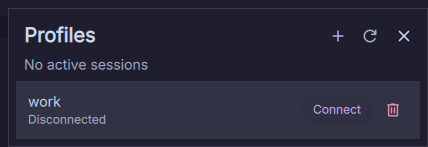

# DankMaterialShell Integration for OpenVPN® 3

An independent DankMaterialShell 1.5 widget for importing and removing OpenVPN® 3 Linux profiles, seeing which sessions are actually connected, and connecting or disconnecting them.



## Requirements

- DankMaterialShell 1.5 or newer
- OpenVPN® 3 Linux
- Python 3 with `dbus-python`

The plugin talks to the documented system D-Bus services provided by OpenVPN® 3 Linux. It does not parse CLI output and does not require root privileges.

## Install for development

```bash
ln -s "$PWD" ~/.config/DankMaterialShell/plugins/openvpn3
dms ipc call plugin-scan scan
```

Enable **DMS Integration for OpenVPN® 3** under DMS Settings → Plugins, then add it to DankBar.

## Version 0.1 scope

- List imported profiles and accessible sessions.
- Treat only the OpenVPN® `CONN_CONNECTED` status as active.
- Start a session from a profile.
- Disconnect a session by its D-Bus object path.
- Import persistent `.ovpn` and `.conf` profiles through the OpenVPN® 3 configuration D-Bus service.
- Remove an imported profile after its active session has been disconnected.
- React to OpenVPN® session-manager and per-session D-Bus events.
- Reconcile state with a slow 60-second fallback poll and refresh after actions.

Interactive authentication is intentionally deferred. If a session needs credentials, OTP, or browser authentication, the widget keeps showing the pending session and directs you to finish authentication with `openvpn3 session-auth`. You can disconnect the pending session from the widget.

OpenVPN® 3 Linux is a separate project and dependency.

## Testing

```bash
python3 -m unittest discover -s tests -v
python3 helper/openvpn3_bridge.py health
python3 helper/openvpn3_bridge.py snapshot
```

`snapshot` is read-only. Connect, disconnect, import, and removal tests against the live services are manual because they change VPN state.

Import names are taken from the selected filename. Profiles that refer to separate certificate or key files may need to be converted to an inline OpenVPN® profile before OpenVPN® 3 can import them. Profile file contents are sent only over D-Bus and are never included in helper JSON output.

## Trademark

This is an independent community plugin and is not affiliated with, endorsed by, or sponsored by OpenVPN Inc. OpenVPN® is a registered trademark of OpenVPN Inc.

## Design references

- [DMS plugin development](https://danklinux.com/docs/dankmaterialshell/plugin-development)
- [OpenVPN® 3 D-Bus overview](https://github.com/OpenVPN/openvpn3-linux/blob/master/docs/dbus/dbus-overview.md)
- [OpenVPN® 3 session service](https://github.com/OpenVPN/openvpn3-linux/blob/master/docs/dbus/dbus-service-net.openvpn.v3.sessions.md)
