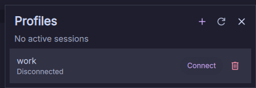

# DankMaterialShell Integration for OpenVPN® 3

An independent DankMaterialShell 1.5 widget for importing and removing OpenVPN® 3 Linux profiles, seeing which sessions are actually connected, and connecting or disconnecting them.



## Requirements

- DankMaterialShell 1.5 or newer
- OpenVPN® 3 Linux
- Python 3 with `dbus-python`

The plugin talks to the documented system D-Bus services provided by OpenVPN® 3 Linux. It does not parse CLI output and does not require root privileges.

## Install for development

```bash
ln -s "$PWD" ~/.config/DankMaterialShell/plugins/openvpn3
dms ipc call plugin-scan scan
```

Enable **DMS Integration for OpenVPN® 3** under DMS Settings → Plugins, then add it to DankBar.

## Version 0.1 scope

- List imported profiles and accessible sessions.
- Treat only the OpenVPN® `CONN_CONNECTED` status as active.
- Start a session from a profile.
- Disconnect a session by its D-Bus object path.
- Import persistent `.ovpn` and `.conf` profiles through the OpenVPN® 3 configuration D-Bus service.
- Remove an imported profile after its active session has been disconnected.
- React to OpenVPN® session-manager and per-session D-Bus events.
- Reconcile state with a slow 60-second fallback poll and refresh after actions.

Interactive authentication is intentionally deferred. If a session needs credentials, OTP, or browser authentication, the widget keeps showing the pending session and directs you to finish authentication with `openvpn3 session-auth`. You can disconnect the pending session from the widget.

OpenVPN® 3 Linux is a separate project and dependency.

## Optional application DNS routing

The plugin can load DNS routing domains from a file or command for each profile.
It uses the DNS server supplied by OpenVPN. A `.json` file contains an array of
domain strings, such as `["example.com", "internal.example.org"]`. Other files
and command output use one domain per line; `#` comments and a leading `~` are
accepted. Each domain includes its subdomains. Catch-all routes and wildcards
are rejected.

Create `~/.config/dms-openvpn3/dns.json`:

```json
{
  "profiles": {
    "work": {
      "enabled": true,
      "file": "~/.config/dms-openvpn3/application-domains.json"
    },
    "another-profile": {
      "enabled": true,
      "command": ["/absolute/path/to/domain-provider", "--argument"]
    }
  }
}
```

Use exactly one `file` or `command` per profile. Profile names must match
OpenVPN's imported names. Commands are argument arrays, run without a shell,
and must complete within ten seconds. They should only print the domain list.
Keep this user-owned configuration in a trusted location. No command is run
as root.

With a file source, run your domain generator manually whenever its input
changes. The plugin only reads the generated file; it does not execute the
generator. It picks up a replaced file on the next connection or plugin load.

Connection and disconnection events trigger DNS setup and cleanup. Initial
plugin load also applies DNS to existing connections. The 60-second VPN status
refresh does not read providers or change DNS. There is no separate watcher or
system service. DNS state is shown on
the profile card, including provider and authorization failures.

This optional feature requires `systemd-resolved` and `resolvectl`. Your desktop
may ask for authorization to change DNS domains and the default DNS route,
according to its existing polkit policy. A DNS error does not disconnect the
VPN. The plugin does not install additional privilege rules.

To remove recurring authorization prompts, an administrator can install the
optional [polkit rule](docs/10-dms-openvpn3-dns.rules) once. Neither the plugin
nor its DNS providers need `pkexec` or root access. Copy the rule to a temporary
file, replace `REPLACE_WITH_USERNAME` with your login name (`id -un`), and
replace `REPLACE_WITH_VPN_INTERFACE` with the VPN interface shown by
`resolvectl status` while connected. Then install your edited copy:

```bash
sudo install -o root -g root -m 0644 /path/to/edited/10-dms-openvpn3-dns.rules /etc/polkit-1/rules.d/10-dms-openvpn3-dns.rules
python3 helper/openvpn3_bridge.py dns-sync
```

The rule allows an active local session of that user to change DNS domains and
the DNS default-route flag on the named interface. This permission applies to
all processes of that user, not only the plugin. It does not grant permission
to change DNS server addresses. If OpenVPN assigns a different interface name
on reconnect, the rule needs updating. On systemd versions that do not pass
the interface name to polkit, this rule grants nothing and prompts remain.
The interface detail is supplied by
[systemd-resolved](https://github.com/systemd/systemd/blob/main/src/resolve/resolved-link-bus.c).

Polkit reloads rules automatically. To restore the original authorization
policy, remove `/etc/polkit-1/rules.d/10-dms-openvpn3-dns.rules`. Removing the
rule does not undo DNS settings already applied; disable DNS routing as
described below first if you also want to restore those settings.

To let OpenVPN set the default-route flag itself, configure the profile once
and disconnect/reconnect:

```bash
openvpn3 config-manage --config work --dns-scope tunnel
```

This runs as the profile owner without sudo. The plugin then needs only the
domain-list authorization, rather than separate prompts for domains and the
default-route flag. Authorization may be requested again after the desktop's
cache expires. To restore OpenVPN's original default scope later, use
`openvpn3 config-manage --config work --unset-override dns-scope` and reconnect.

To disable the feature, set `enabled` to `false` and run
`python3 helper/openvpn3_bridge.py dns-sync` from the plugin directory. It
restores the previous routing settings while the interface still exists.
On disconnect, OpenVPN removes its interface and associated DNS settings;
the plugin also restores settings if an inactive interface remains. If DMS
is closed or crashes while the VPN stays connected, routes remain until the
plugin runs again or OpenVPN removes the interface. Disconnect before removing
the plugin if its DNS feature is active.

Verify while connected:

```bash
resolvectl status
resolvectl query --cache=no your.application.example
resolvectl query --cache=no example.org
```

The application query should resolve through the OpenVPN interface; unrelated
queries use your existing DNS routes. Browsers with a separate DNS-over-HTTPS
resolver can bypass system DNS. Disconnect and reconnect to verify that the
routes disappear and return automatically.

For a manual reconciliation using the same helper as the UI:

```bash
python3 helper/openvpn3_bridge.py dns-sync
```

## Testing

```bash
scripts/lint-qml
python3 -m unittest discover -s tests -v
python3 helper/openvpn3_bridge.py health
python3 helper/openvpn3_bridge.py snapshot
```

The lint script discovers `qmllint` from `PATH` or Qt 6's standard Arch Linux
location. DMS does not currently ship QML type metadata for its `qs.*` modules,
so warnings caused solely by those unresolved framework types are disabled.

`snapshot` is read-only. Connect, disconnect, import, and removal tests against the live services are manual because they change VPN state.

Import names are taken from the selected filename. Profiles that refer to separate certificate or key files may need to be converted to an inline OpenVPN® profile before OpenVPN® 3 can import them. Profile file contents are sent only over D-Bus and are never included in helper JSON output.

## Trademark

This is an independent community plugin and is not affiliated with, endorsed by, or sponsored by OpenVPN Inc. OpenVPN® is a registered trademark of OpenVPN Inc.

## Design references

- [DMS plugin development](https://danklinux.com/docs/dankmaterialshell/plugin-development)
- [OpenVPN® 3 D-Bus overview](https://github.com/OpenVPN/openvpn3-linux/blob/master/docs/dbus/dbus-overview.md)
- [OpenVPN® 3 session service](https://github.com/OpenVPN/openvpn3-linux/blob/master/docs/dbus/dbus-service-net.openvpn.v3.sessions.md)
